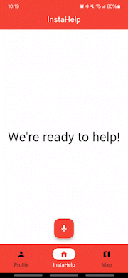
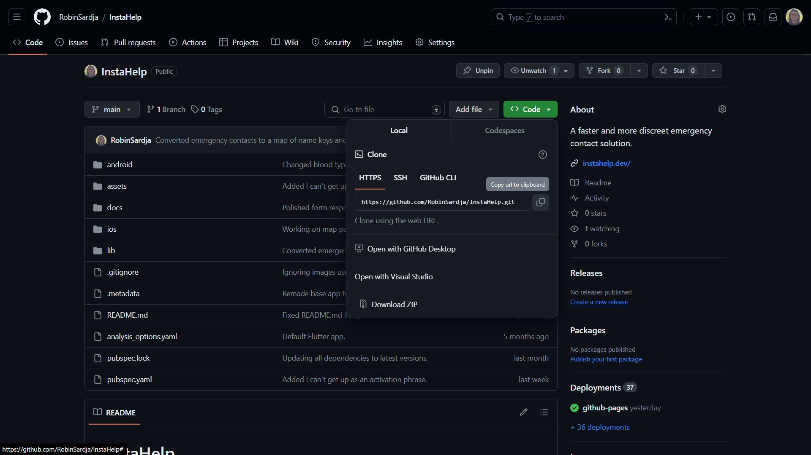
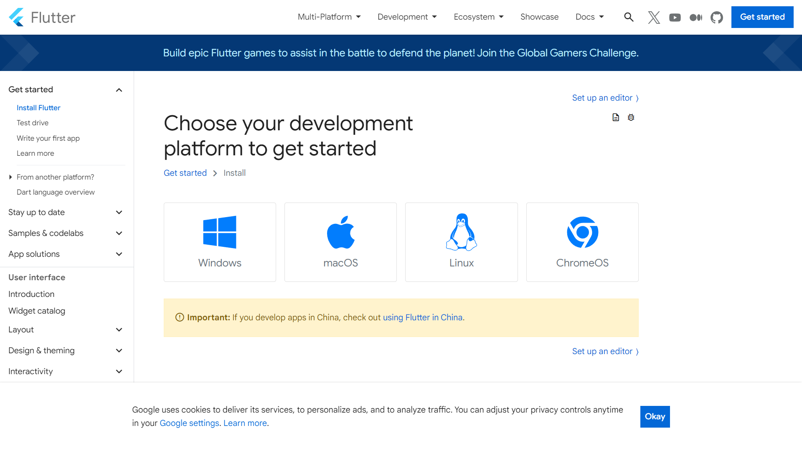
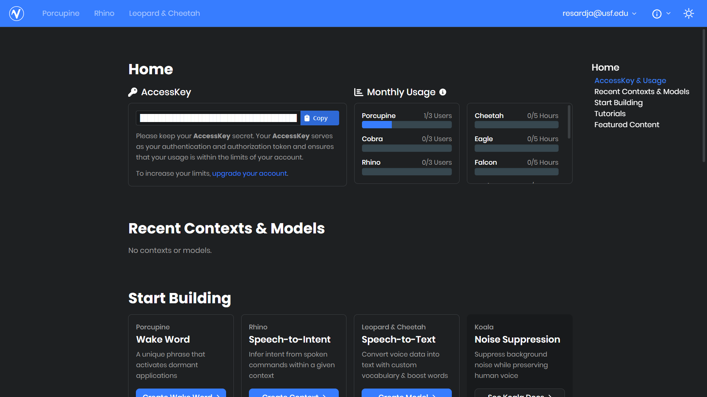

# InstaHelp

<style>
.center {
  display: block;
  margin-left: auto;
  margin-right: auto;
  width: 50%;
}
</style>

<div class="center">
    
    
    
</div>

InstaHelp is a voice-activated emergency contact mobile application that detects natural human responses to emergency situations.

Upon activation, InstaHelp can send a text message to the user's designated emergency contacts and attract the attention of people nearby by blaring a loud siren from the user's phone and blinking the user's phone's flashlight.

InstaHelp provides a faster and more discreet emergency contact solution by removing the dependence on proprietary activation phrases that users may not recall in their time of need and attackers may recognize as the user's attempt to call for help.

## First-Time Setup

### 1. Clone our GitHub repo

The fully functional InstaHelp prototype is available on our [GitHub](https://github.com/RobinSardja/InstaHelp). Visit the link to download our ZIP file or use git to clone our repository with the following command.
```console
git clone https://github.com/RobinSardja/InstaHelp.git
```



### 2. Download the Flutter SDK

Running InstaHelp requires [the Flutter SDK](https://docs.flutter.dev/get-started/install). All instructions for getting started on all major platforms are available through the provided link.



### 3. Sign Up with Picovoice

Our voice activation feature requires an access key from [Picovoice](https://console.picovoice.ai/signup). Your account will provide you with your own access key to enable the Picovoice API.



### 4. Flutter run

Open a terminal in the same directory as the InstaHelp repository. You'll first need to get all of our dependencies with the following command.

```console
flutter pub get
```

Now run The Flutter SDK with your Picovoice access key. For example, if "abcd" is your access key, enter the following command into your terminal.
```console
flutter run --dart-define=picovoice=abcd
```